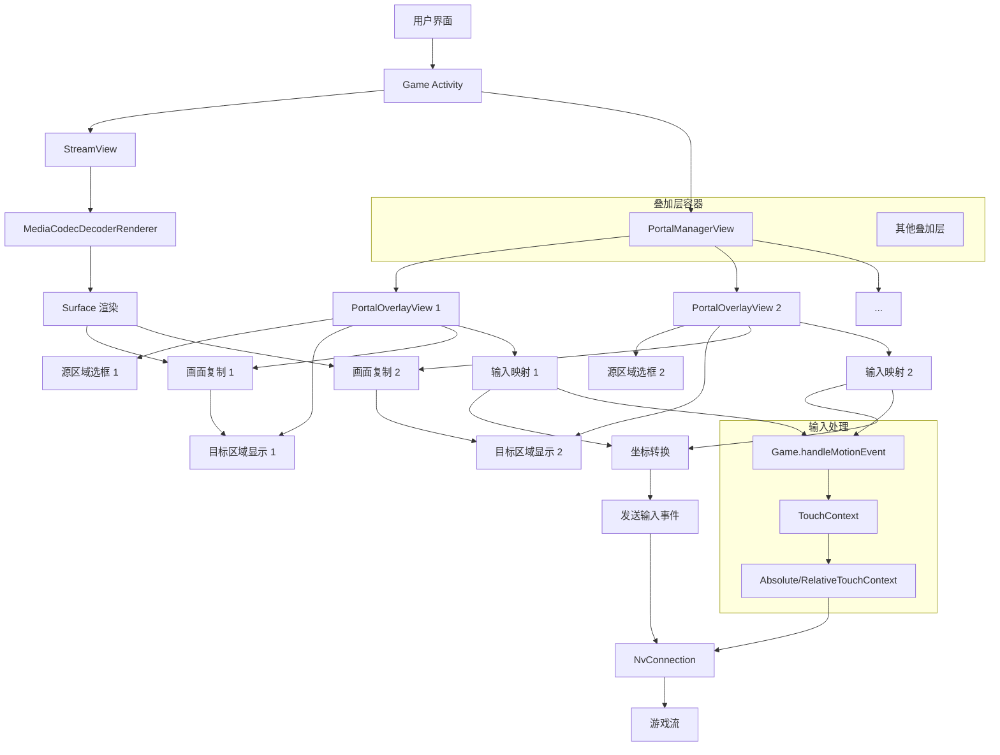

# 放大镜/传送门效果实现文档

## 概述

本功能旨在实现一个类似放大镜或传送门的效果，允许用户在串流画面上选择一个或多个源区域（选框），并将其内容实时显示在对应的目标区域（空白区域）。同时，支持点击目标区域时，将点击事件正确映射到源区域的对应位置，实现“画中画”交互，并支持多传送门并行。

## 需求分析

1. **叠加层遮挡**：屏幕上有叠加层（如虚拟键盘、菜单）会遮挡部分画面。
2. **源区域选择**：用户可拖拽/调整一个或多个矩形选框，选择被遮挡的区域。
3. **目标区域显示**：将每个源区域的内容复制到对应的空白区域（如屏幕角落）显示。
4. **输入映射**：点击目标区域时，能正确触发对应源区域对应位置的点击事件。
5. **多传送门**：支持同时创建和管理多个传送门，每个传送门独立配置。
6. **高性能**：需要低延迟的画面复制和输入映射，不影响串流性能。

## 现有架构分析

### 画面渲染
- 主画面：`StreamView`（继承 `SurfaceView`），通过 `MediaCodecDecoderRenderer` 解码渲染视频流。
- 叠加层：`activity_game.xml` 中使用 `FrameLayout` 容器（`controlsOverlayContainer`、`menuOverlayContainer`）管理虚拟键盘、菜单等。
- 坐标系统：触摸事件通过 `Game.handleMotionEvent` 处理，使用 `getStreamViewRelativeNormalizedXY` 将屏幕坐标转换为流画面相对坐标（归一化）。

### 输入处理
- `AbsoluteTouchContext`：绝对坐标模式，将触摸点直接映射为鼠标位置。
- `RelativeTouchContext`：相对坐标模式，模拟触摸板移动。
- 输入事件最终通过 `NvConnection` 发送到游戏主机。

## 设计方案

### 1. 新增视图组件
- **PortalManagerView**：管理多个传送门的容器视图。
- **PortalOverlayView**：单个传送门的视图，负责绘制源区域选框和目标区域显示。
- 添加到 `controlsOverlayContainer` 或新建专用容器（如 `portalOverlayContainer`），确保正确的叠加层级。

### 2. 画面复制方案
#### 方案A：纹理复制（高性能）
- 修改 `MediaCodecDecoderRenderer`，在 GPU 端将多个源区域纹理复制到多个目标纹理。
- 使用 `GLSurfaceView` 或 `TextureView` 渲染目标纹理。
- 优点：性能最佳，延迟低。
- 缺点：需要修改渲染管线，复杂度高。

#### 方案B：Bitmap 截取（中等性能）
- 通过 `Surface` 的 `lockCanvas` 或 `TextureView` 的 `getBitmap` 截取画面。
- 将截取的 Bitmap 绘制到各个 `PortalOverlayView` 的目标区域。
- 优点：实现简单，无需修改解码器。
- 缺点：频繁 Bitmap 操作可能影响性能，多传送门时性能下降明显。

#### 方案C：双 Surface 渲染（折中）
- 创建多个辅助 `SurfaceView` 用于显示目标区域。
- 让 `MediaCodecDecoderRenderer` 同时输出到多个 Surface（主 Surface + 多个辅助 Surface）。
- 通过 `Surface.setMatrix` 或 `SurfaceView.setTransform` 实现区域裁剪和缩放。
- 优点：利用硬件加速，无需 Bitmap 复制，支持多传送门。
- 缺点：需要解码器支持多 Surface 输出，可能有 Surface 数量限制。

**推荐方案A**
🏆 方案A：纹理复制 (GPU Share Context) - [推荐]
这是视频编辑、直播特效、相机应用（如抖音、Snapchat）的标准做法。
原理： MediaCodec 将视频帧解码到 SurfaceTexture (OES 纹理)。你只需要在 Fragment Shader 中，将同一个纹理 ID (SamplerExternalOES) 绑定到不同的坐标位置进行绘制。

### 3. 输入映射
- 拦截目标区域的触摸事件，确定是哪个传送门的目标区域。
- 计算相对于目标区域的位置。
- 根据源区域和目标区域的缩放比例，映射回源区域的坐标。
- 调用 `conn.sendMousePosition` 或 `conn.sendTouchEvent` 发送映射后的坐标。
- 注意：需要处理坐标归一化（0~1）和流画面实际分辨率。

### 4. 多传送门管理
- **传送门列表**：使用 `List<PortalConfig>` 存储每个传送门的配置（源区域、目标区域、是否启用等）。
- **视图管理**：`PortalManagerView` 负责创建、销毁、更新各个 `PortalOverlayView`。
- **性能优化**：限制同时激活的传送门数量（如最多 4 个），避免过多 Surface 影响性能。

### 5. 交互设计
- **选框操作**：支持拖拽移动、调整大小、旋转（可选）。
- **传送门管理**：添加、删除、复制传送门；支持批量操作。
- **显示控制**：可开关单个或全部传送门，调整目标区域位置和大小。
- **性能设置**：选择画面复制模式（高/中/低质量），设置最大传送门数量。

## 详细实现步骤

### 阶段一：基础框架
1. 创建 `PortalConfig` 数据类，存储传送门配置。
2. 创建 `PortalOverlayView` 类，继承 `View`，表示单个传送门。
3. 创建 `PortalManagerView` 类，继承 `ViewGroup`，管理多个 `PortalOverlayView`。
4. 在 `Game` 中添加成员变量，并在 `onCreate` 中初始化 `PortalManagerView`。
5. 将 `PortalManagerView` 添加到 `controlsOverlayContainer`。
6. 实现单个传送门的选框绘制（矩形边框、拖拽手柄）。

### 阶段二：画面复制
1. 研究 `MediaCodecDecoderRenderer` 的多 Surface 支持。
2. 创建辅助 `SurfaceView` 池，每个激活的传送门对应一个辅助 SurfaceView。
3. 实现区域裁剪：通过 `Surface.setMatrix` 或 `SurfaceView.setTransform`。
4. 测试多传送门画面复制效果。

### 阶段三：输入映射
1. 重写 `PortalOverlayView.onTouchEvent`，处理目标区域触摸。
2. 实现坐标映射算法：
   ```java
   float srcX = (targetX - targetRect.left) / targetRect.width() * srcRect.width() + srcRect.left;
   float srcY = (targetY - targetRect.top) / targetRect.height() * srcRect.height() + srcRect.top;
   ```
3. 将映射后的坐标转换为流画面相对坐标（归一化）。
4. 调用 `conn.sendMousePosition` 发送事件。
5. 在 `PortalManagerView` 中协调多个传送门的输入事件。

### 阶段四：多传送门交互
1. 添加传送门管理 UI（可通过游戏菜单访问）。
2. 实现添加、删除、复制传送门功能。
3. 实现传送门配置的保存和加载（SharedPreferences 或 JSON 文件）。
4. 添加性能监控，限制最大传送门数量。

### 阶段五：优化与测试
1. 性能优化：动态调整画面复制质量，非活跃传送门降低更新频率。
2. 内存管理：及时释放不再使用的 Surface 和纹理。
3. 兼容性测试：不同 Android 版本、GPU 型号、分辨率。

## 架构图



## 关键代码示例

### PortalConfig 数据类
```java
public class PortalConfig {
    public int id;
    public RectF srcRect; // 源区域
    public RectF dstRect; // 目标区域
    public boolean enabled;
    public String name;
    // 其他配置：缩放模式、透明度、边框颜色等
}
```

### PortalManagerView 框架
```java
public class PortalManagerView extends FrameLayout {
    private List<PortalConfig> portalConfigs = new ArrayList<>();
    private Map<Integer, PortalOverlayView> portalViews = new HashMap<>();
    private Game game;
    
    public PortalManagerView(Context context, Game game) {
        super(context);
        this.game = game;
        loadConfigs();
        createViews();
    }
    
    private void loadConfigs() {
        // 从 SharedPreferences 加载配置
        // 默认创建一个传送门
        PortalConfig config = new PortalConfig();
        config.id = 1;
        config.srcRect = new RectF(100, 100, 300, 300);
        config.dstRect = new RectF(800, 100, 1000, 300);
        config.enabled = true;
        config.name = "传送门1";
        portalConfigs.add(config);
    }
    
    private void createViews() {
        for (PortalConfig config : portalConfigs) {
            if (config.enabled) {
                PortalOverlayView view = new PortalOverlayView(getContext(), config, game);
                portalViews.put(config.id, view);
                addView(view);
            }
        }
    }
    
    public void addPortal(PortalConfig config) {
        portalConfigs.add(config);
        if (config.enabled) {
            PortalOverlayView view = new PortalOverlayView(getContext(), config, game);
            portalViews.put(config.id, view);
            addView(view);
        }
        saveConfigs();
    }
    
    public void removePortal(int id) {
        PortalOverlayView view = portalViews.remove(id);
        if (view != null) {
            removeView(view);
        }
        portalConfigs.removeIf(config -> config.id == id);
        saveConfigs();
    }
}
```

### 多传送门输入映射
```java
public class PortalOverlayView extends View {
    private PortalConfig config;
    private Game game;
    
    @Override
    public boolean onTouchEvent(MotionEvent event) {
        if (!config.enabled || !config.dstRect.contains(event.getX(), event.getY())) {
            return super.onTouchEvent(event);
        }
        
        // 坐标映射
        float srcX = mapCoordinate(event.getX(), config.dstRect, config.srcRect, true);
        float srcY = mapCoordinate(event.getY(), config.dstRect, config.srcRect, false);
        
        // 转换为流画面相对坐标
        float[] normalized = game.getStreamViewRelativeNormalizedXY(srcX, srcY);
        
        // 发送输入事件
        switch (event.getAction()) {
            case MotionEvent.ACTION_DOWN:
                game.getConnection().sendMousePosition(
                    (short)(normalized[0] * 65535),
                    (short)(normalized[1] * 65535),
                    (short)game.getStreamView().getWidth(),
                    (short)game.getStreamView().getHeight());
                game.getConnection().sendMouseButtonDown(MouseButtonPacket.BUTTON_LEFT);
                break;
            case MotionEvent.ACTION_UP:
                game.getConnection().sendMouseButtonUp(MouseButtonPacket.BUTTON_LEFT);
                break;
            // 其他事件处理
        }
        return true;
    }
}
```

## 性能优化建议

1. **画面复制**：使用硬件加速的 Surface 复制，避免 CPU 拷贝 Bitmap。
2. **事件处理**：使用 `requestUnbufferedDispatch` 减少输入延迟。
3. **绘制优化**：仅当源区域或目标区域变化时重绘。
4. **内存管理**：及时释放不再使用的 Surface 和纹理。
5. **数量限制**：根据设备性能动态限制最大传送门数量（如高端设备 4 个，低端设备 2 个）。
6. **更新频率**：非活跃传送门降低更新频率（如 30 FPS），活跃传送门保持全帧率（60 FPS）。

## 测试计划

1. **功能测试**：
   - 单个传送门功能正常。
   - 多传送门同时工作，互不干扰。
   - 传送门管理（添加、删除、复制）功能正常。
   - 点击目标区域能正确触发对应源区域事件。

2. **性能测试**：
   - 不同数量传送门时的帧率变化。
   - 输入延迟测量。
   - 内存占用监控。
   - 电量消耗测试。

3. **兼容性测试**：
   - 不同 Android 版本（8.0+）。
   - 不同 GPU 型号。
   - 不同分辨率串流。
   - 不同叠加层组合（虚拟键盘、菜单等）。

4. **压力测试**：
   - 创建最大数量传送门并频繁交互。
   - 长时间运行稳定性测试。

## 后续扩展

1. **高级滤镜**：在目标区域应用放大、锐化、色彩增强等滤镜。
2. **自动跟踪**：自动跟踪游戏中的特定元素（如血条、地图、敌人）。
3. **手势控制**：通过手势快速创建和调整传送门。
4. **智能布局**：自动排列多个传送门，避免重叠。
5. **场景预设**：保存和加载传送门布局预设，适应不同游戏。
6. **远程控制**：通过外部设备（如手机）管理传送门配置。

## 结论

放大镜/传送门效果是一个提升游戏串流体验的有用功能，特别是在有叠加层遮挡的情况下。多传送门支持进一步增强了实用性，允许用户同时监控多个关键区域。通过合理的架构设计，可以在保持高性能的同时实现所需功能。建议采用方案C（多 Surface 渲染）作为画面复制方案，结合现有的输入处理框架实现坐标映射。

文档编写完成，已保存到 `.docs/05-放大镜传送门效果设计与实现.md`。